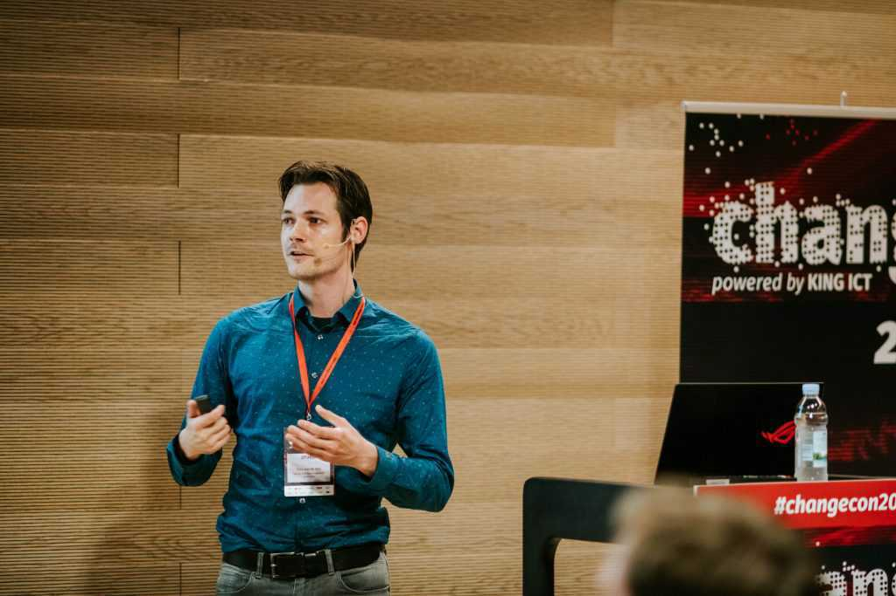

I'm a passionate Senior software engineer working for <a href="www.jdriven.com" title="JDriven" alt="JDriven" target="_blank">JDriven</a>
After many hours of fixing bugs a passion grew inside me, I wanted to find a way to prevent these bugs from occurring in the first place.
This passion set me on the path to learning more about software engineering fundamentals and about software engineering as a craft.

 
 

I also found that sharing knowledge is a fun and useful way to expand my knowledge and to make a bit of impact in the field.
I try to share knowledge by giving presentations at my company, customers (I can also almost always be found coaching junior developers there) and <a href="/talks" title="conferences" alt="conferences">conferences</a>.
I also love to give <a href="/workshops" title="workshops" alt="conferences">Trainings / workshops</a> and write some <a href="https://blog.jdriven.com/author/ties-van-de-ven/" target="_blank" title="blogs" alt="blogs">blogs</a> now and then.
What I feel that sets me aside from most other trainers/coaches is that I try to avoid the tecnhical details and focus more on concepts and looking at what problems we are trying to solve before going into possible solutions.

Lastly I try to be a bit of an advocate for Functional programming/software fundamentals.
These topics are often misunderstood as being complex (mostly because most literature about it is aimed for people with an academic background).
If you or your team are interested in these topics and would like these concepts explained in a clear, easy to understand matter, feel free to send me a message on LinkedIn or Twitter (links below).
I would love to help you out! (doesn't even have to cost money, knowledge on how to be better at our craft should be accessible for everyone).

