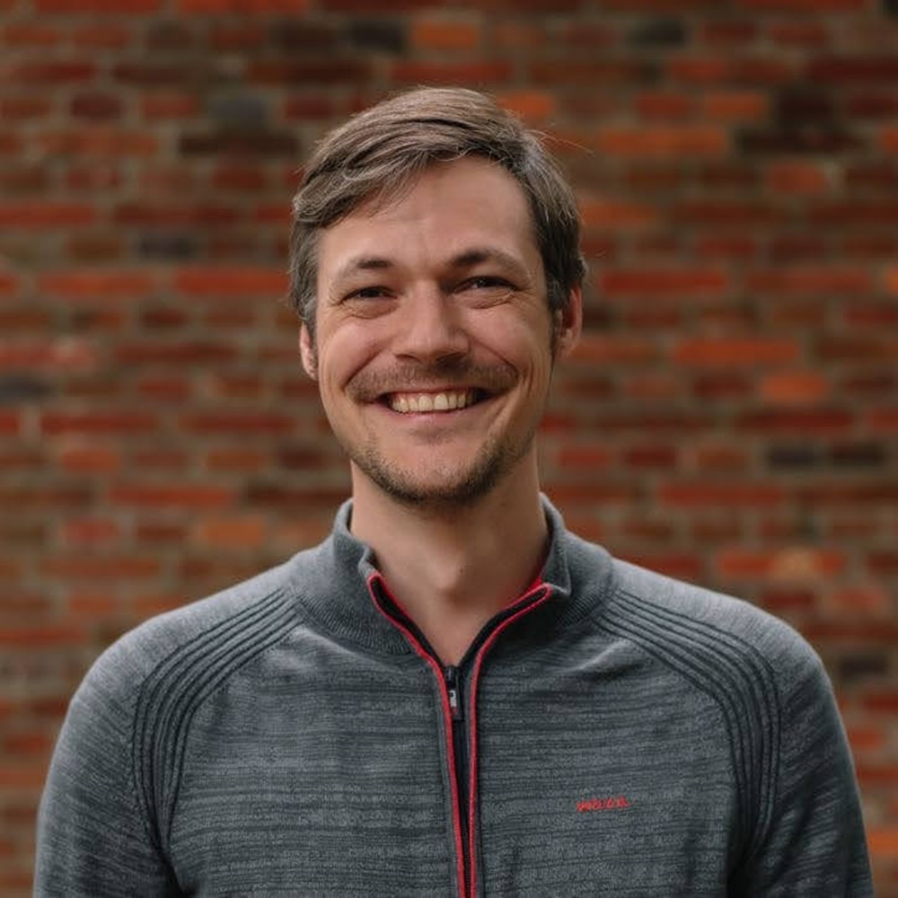

Ties is a passionate Senior Software Engineer working for JDriven. 
After many hours of fixing bugs, Ties wanted to find ways to prevent these bugs from ever occurring.
During this quest to eliminate bugs he encountered Functional Programming. 
Trough learning functional programming Ties developed a passion for Software Fundamentals, which he loves to talk about.

 
 

Aside from learning software fundamentals Ties also likes to make impact by sharing this knowledge.
He does this by giving talks within companies or <a href="/talks" title="conferences" alt="conferences">conferences</a>, writing <a href="https://blog.jdriven.com/author/ties-van-de-ven/" target="_blank" title="blogs" alt="blogs">blogs</a>, providing training on functional programming, and by coaching junior developers.
He usually takes the practical approach by first explaining which problem we are trying to solve before going into technical details.
His many years of teaching experience helps in explaining concepts in an easy to understand way.

 
 

Lastly he likes to be a bit of an advocate for Functional programming/software fundamentals.
These topics are often misunderstood as being complex (mostly because most literature about it is aimed for people with an academic background).
If you or your team are interested in these topics and would like these concepts explained in a clear, easy to understand matter, feel free to send a message on LinkedIn or Twitter (links below).
He would love to help you out! (doesn't even have to cost money, knowledge on how to be better at our craft should be accessible for everyone).

